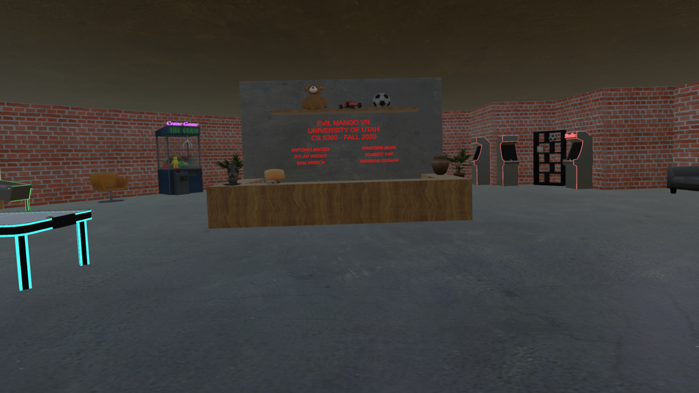
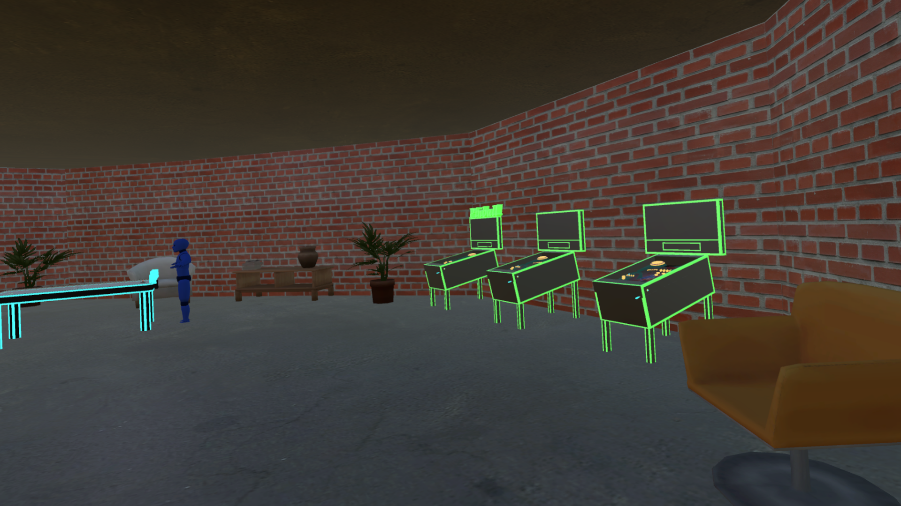
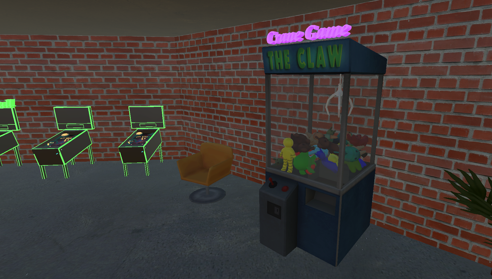
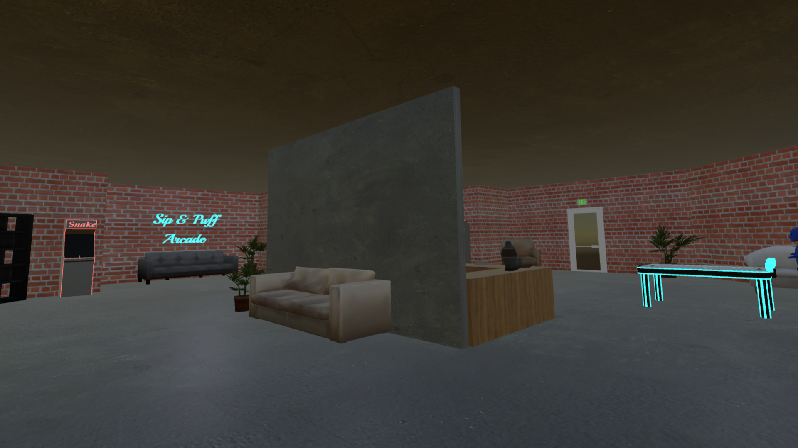
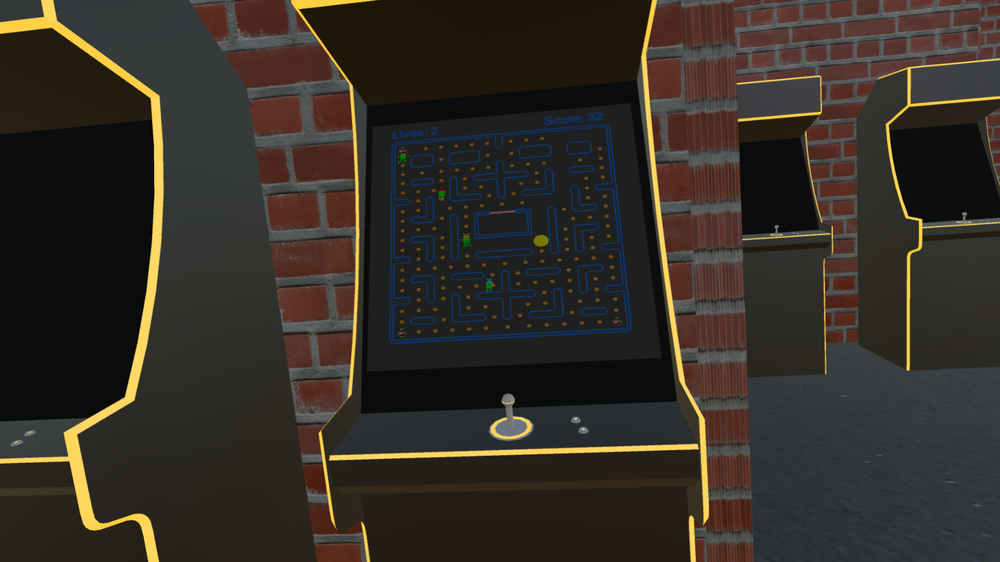

# Sip and Puff VR Arcade

*An Evil Mango VR Project for the University of Utah Health Department*

## About Us

- Team Name: Evil Mango Studio
- Location: Salt Lake City, Utah
- Release Date: 12/9/2020
- Platforms: Steam VR Capable Hardware (HTC Vive, Oculus)

### Description

Sip and Puff Arcade is a nostalgic arcade where simple, timeless games are brought to life in a whole new way with a specific emphasis on accessibility. Using classic arcade games, we hope to be able to aid in the training of the use of controllers designed for people with disablilites, such as the University of Utah Sip and Puff device. Each different game seeks to aid the user with their ability to interact with their controller to play games and interact with other devices in the real world.

## History

The CS 5360 Virtual Reality course at the University of Utah was a project base coursed. As a group, we decided to implement a Virtual Reality Arcade. After hearing some of the external project pitch ideas, specifically the Sip and Puff project, we decided to make our project an accessibility training application by implementing the game with accessibility as the main priority. We were inspired by the opportunity to create a fun and creative game with a real purpose that hopefully can be played by everyone.

## Features

- Accessibility: Ability to use the University of Utah Sip and Puff controller to play games in Virtual Reality
- Training: Trains people to use the Sip and Puff device accurately in real-life scenarios, like Tetra Ski and Sail.

## Feature Video
### Visual demo of each game in the arcade.
<iframe width="560" height="315" src="https://www.youtube.com/embed/RSS15FFwwLA" frameborder="0" allow="accelerometer; autoplay; clipboard-write; encrypted-media; gyroscope; picture-in-picture" allowfullscreen>
</iframe>

## Images

### Spawning the first time

### View of Airhockey and Pinball

#### Airhockey

#### Crane Game Pinball View

### Pinball

### Crane Game

#### Crane Game Couch View

#### Snake In Game

#### PuffMan

## About

### The Team
Our team formed remotely through the class Slack channel. A few of us have worked together in previous CS courses, but for the most part, we all met through this project. Our team name "Evil Mango" came about by needing a team name, so we combined some of our discord names to make a group name. 

### Credits
- Project Manager: Brayden Muir
- Puffman: Robert Kay
- Airhockey: Dylan Wendt
- Pinball: Sam Hirsch
- Snake: Warren Kidman
- Crane Game: Antonio Arceo
- Sip and Puff Integration: Sam Hirsch
- 3D Modeling: Dylan Wendt
- Textures: Robert Kay
- Asset Collection: Warren Kidman

### Contact
- Brayden Muir: bamuir3@outlook.com
- Robert Kay: u0695241@utah.edu
- Dylan Wendt: u1217864@utah.edu
- Sam Hirsch: sam.hirsch66@gmail.com
- Faculty Sponsor, Rogelio E. Cardona-Rivera: rogelio@cs.utah.edu

